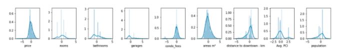

# Price Predictor - Brasília Apartments - Project Overview
 
## Motivation
 
The main objective of the project was to work with a messy data set, extracted from the web and even with  a relatively small dataset with a few features. I spended a lot of time in the feature engineering processes to be able to build a regression model that gives us a very good score. 
 
## Overview
 
* Created a predictor that estimates the Brasilia apartments prices to help buyers and sellers to deal
* Scraped over 3000 apartments for sale from Vila Real using python and selenium
* Engineered features from the address filled by the sellers, to get the address, neighborhood and the AR (administrative region) correctly returned by the Correios API.
* Built a pipeline that optimized Lasso, KernelRidge, Elastic Net, XGBRegressor and LGBRegressor using GridsearchCV to reach the best model.
 
## Resources Used
 
**Python Version**: 3.7 
**Packages**: pandas, numpy, selenium, bs4, consulta_correios, unidecode, geopy, six, math, folium, seaborn, matplotlib, sklearn, xgboost, lightgbm, yellowbrick, joblib 
**Correios API Github**: https://github.com/arthurfortes/consulta_correios
 
## Web Scraping
 
Scraped over 3000 apartments from all over Brasília from Viva Real website. With each apartament, we got the address, the title, the area in m², the number of rooms, number of bathrooms, number of garages, the condo fees, the price and the amenidades items.
 
## Feature Engineering
 
After scraping, I needed to clean it up so that it was usable for our model. I made the following changes and created the following features:
* Dropped the null features 
* Cleaned the address columns and sent parts of the address to de Correio API to get the correct Address and defining the Neighborhood and AR column.
* Filled all Address null values 
* Filled all the Neighborhood null values 
* Filled all AR null values
* Filled the apartments characteristics looking for the median of the addresses, neighborhoods or RAs.
* Got the Geo Location using geocoder to calculate and create the column Distance to the Downtown
* Made a new column for Per Capita Income (PCI) of the ARs scrapped from wikipedia
* Made a new column for Population of the ARs scrapped from wikipedia
 
## Data Visualization and Data Preparation
 
To understand and prepare the DataFrame for the modeling I plotted a few visualization.
 
* Frist, before dropping latitude and longitude, I plotted the apartments on the map.
 

 

 
* Second, I plotted the DF as Box Plot and look for some inaccuracy and outliers
 

 

 
* Third, for understanding the normalization, I plotted the distribution before and after normalization and scale.
 

 
 
 
 
* Fourth, to visualize the personal correlation I used a Heat Map. 
 

 

 
 
## Model
 
First I transformed the categorical variables into dummy variables and also split the data into train and test sets with a test size of 30%.
To choose the best model I tried Lasso (l1), Kernel Ridge (l2), Elastic NNet, Xgb Regressor or Lgbm Regressor . I created a Pipeline with Hyperparameter Tuning using Grid Search and 10 K-Folds shuffled. The score used will be neg_root_mean_squared_error.
 
## Model performance
 
The best model was XGBRegressor reaching the following scores in the test set:
* Mean absolute error = 0.18703
* Mean squared error = 0.38578
* Median absolute error = 0.09873
* Explain variance score = 0.85117
* R2 score = 0.85117
 
 
Author: Erick C. Varela 
Date: 17/12/2020

 
 
 

## For the full dynamic visualizations:

### [See The Kernel On Kaggle](https://www.kaggle.com/erickvarela/price-prediction-brasilia-apartments)

### [Or On Nbviewer](https://nbviewer.jupyter.org/github/varelaerick/Price-Predictor-Bras-lia-Apartments/blob/main/price-prediction-brasilia-apartments.ipynb)
